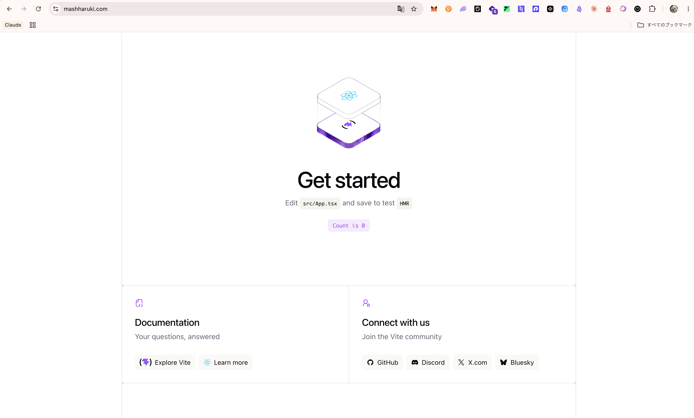

# CloudFront-Domain-Sample
CloudFront とカスタムドメインの使い方を学ぶためのサンプルリポジトリです。

## 技術スタック

- React
- Vite
- TypeScript
- CDK
- CloudFront
- S3
- Route53
- ACM

## デプロイ手順

このサンプルは `mashharuki.com` と `www.mashharuki.com` を CloudFront に割り当て、正規 URL を `https://mashharuki.com` にします。

1. `pnpm install`
2. AWS アカウントが正しいことを確認する

   ```bash
   aws sts get-caller-identity
   ```

3. 初回だけ CDK bootstrap を実行する

   ```bash
   pnpm cdk cdk bootstrap aws://796032104877/us-east-1
   ```

   AWS profile を使う場合:

   ```bash
   AWS_PROFILE=<your-profile> pnpm cdk cdk bootstrap aws://796032104877/us-east-1
   ```

4. Hosted Zone を作成する

   ```bash
   pnpm cdk run deploy DomainStack
   ```

5. `DomainStack` の `NameServers` output を、お名前.com 側の `mashharuki.com` ネームサーバーに設定する

以下の値でも取得できる

```bash
aws cloudformation describe-stacks \
   --stack-name DomainStack \
   --region us-east-1 \
   --query "Stacks[0].Outputs[?OutputKey=='NameServers'].OutputValue" \
   --output text
```

6. `dig NS mashharuki.com` で Route53 への委任を確認する
7. フロントエンドをビルドする

   ```bash
   pnpm frontend build
   ```

8. 静的サイト配信リソースを作成する

   ```bash
   pnpm cdk run deploy StaticSiteStack
   ```

確認 URL:

- `https://mashharuki.com`
- `https://www.mashharuki.com`

`www` は CloudFront Function で apex ドメインへ 301 リダイレクトします。S3 バケットは非公開で、CloudFront Origin Access Control 経由のみアクセスできます。

以下のようになればOK!



## トラブルシュート

### `No bucket named 'cdk-hnb659fds-assets-...-us-east-1'`

対象アカウントの `us-east-1` で CDK bootstrap が未実行です。CloudFront 用 ACM 証明書は `us-east-1` に必要なため、このサンプルの CDK スタックも `us-east-1` 固定です。

```bash
pnpm cdk cdk bootstrap aws://796032104877/us-east-1
```

bootstrap 後に再度デプロイしてください。

```bash
pnpm cdk deploy DomainStack
```
